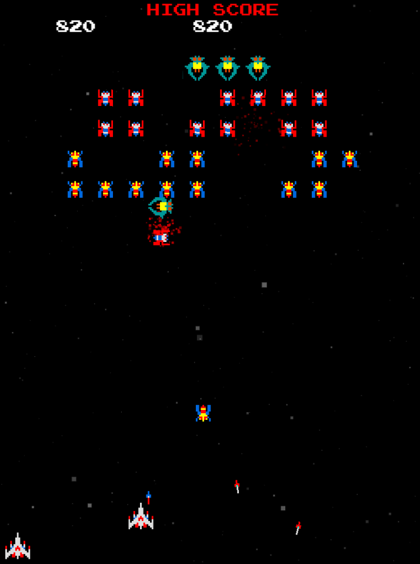

# Galaga Project

[Play Online!](https://galaga.ccaden.me/)

By Caden Harris and Kollin Murphy

## Instructions to Run

- Run `npm install`
- Run `npm start`
- Open `http://localhost:3000` in your browser

<!-- add image -->

## Description

This project is a recreation of the classic arcade game Galaga. The player controls a spaceship that can move left and right and shoot bullets. Perfectly timed bullets can pierce through enemies. Enemies fly in from the top of the screen and move in a random direction. If the player collides with an enemy, they lose a life. If the player shoots an enemy, the enemy is destroyed and the player gains points. The player can also gain points by destroying a formation of enemies. The game is over when the player loses all of their lives. There is an infinite loop of levels, so the player can play forever.

### Technical Description

This project was created using React and TypeScript. The game uses a canvas element to display the game. The canvas is a 2D element, so the game is displayed in 2D.
